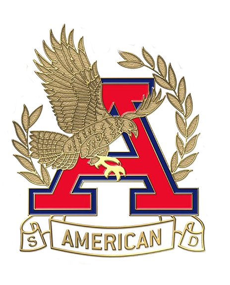

<!DOCTYPE html>
<html>
<head>
<title>AHS Speech & Debate</title>
<meta name="viewport" content="width=device-width, initial-scale=1">

</head>

<strong>Contact: americanspeechdebate@gmail.com  </strong>
<strong>36300 Fremont Blvd, Fremont, CA 94536</strong>

</style>
</head>
<body>

  

    American High School Speech & Debate
  

  

    

      <a href="#home">Home</a>
      <a href="#tournaments">Tournaments</a>
      <a href="#resources">Resources</a>
      <a href="#about">About</a>
    

    <body>

</body>
</html>

</body>
</footer>

</html>
